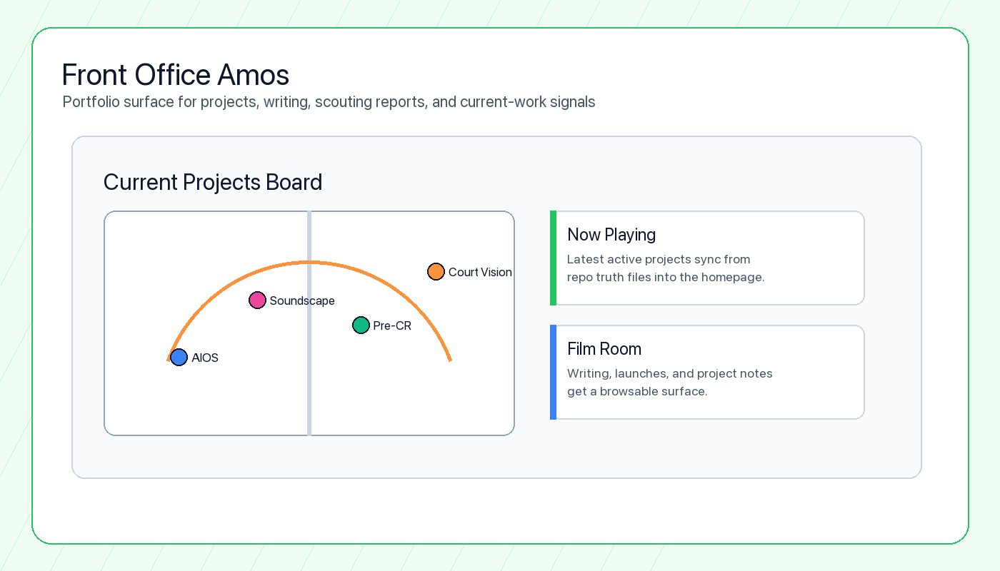

# front-office-amos

Vite/React portfolio app for the Front Office Amos project. It combines the main React entry, public assets, evidence-backed status projection, and docs/planning material for the portfolio surface.



## Why This Matters

### Problem

A portfolio can go stale quickly when the work lives across many repos. Static project cards do not show current project health, recent progress, or the difference between polished shipped work and active engineering bets.

### Who It Helps

This site helps recruiters, hiring managers, collaborators, and future teammates understand what I am building without cloning several repos or reading raw planning files.

### What I Built

I built a React/Vite portfolio with project pages, a current-project board, writing/blog surfaces, Film Room content, deployment tooling, and tracker sync that pulls project status from local `.tracker/PROJECT_TRUTH.md` files.

### Technical Decisions

- Project status is generated from repo truth files so public content can stay aligned with active work.
- The portfolio uses a sports-front-office metaphor because it matches the basketball/data/product work I want to showcase.
- Content integrity, typecheck, and build gates are wired into the local workflow so static catalog edits still get useful verification.
- Netlify deploy checks use repo-local tooling instead of relying on unstable global CLI state.

### How To Run It

```bash
pnpm install
pnpm sync
pnpm dev
pnpm lint
pnpm build
```

### What I Would Improve Next

The next improvements are tighter browser smoke coverage for interactive project-board behavior, clearer handling for large ignored draft assets, and continued weekly tracker ingestion from the deploy branch.

## Scope

This is the top-level portfolio application workspace.

The package is marked private in `package.json`, so it is intended for local workspace use rather than package publishing.

## Repository Layout

- `.claude/` - project directory.
- `.env.example` - project file.
- `.github/` - project directory.
- `.gitignore` - project file.
- `.planning/` - project planning state.
- `.tracker/` - public evidence map, reviewed-project allowlist, and media curation metadata.
- `Draft_Refresh/` - project directory.
- `Jakye_Amos_Comprehensive_CV.docx` - project file.
- `Redesign Basketball Project Dashboard/` - project directory.
- `docs/` - supporting documentation.
- `index.html` - project file.
- `jakyeamos_masterresumereference 8_15_25.docx (5).pdf` - project file.
- `metadata.json` - project file.
- `netlify.toml` - project file.
- `package.json` - package metadata and scripts.
- `public/` - static assets.
- `scripts/` - automation and sync scripts.
- `src/` - source code and React app internals.
- `tsconfig.json` - TypeScript configuration.
- `vite.config.ts` - Vite configuration.

## Common Commands

- `pnpm dev` - `vite --port=3000 --host=0.0.0.0`
- `pnpm build` - `vite build`
- `pnpm preview` - `vite preview`
- `pnpm test:e2e` - browser coverage at desktop, laptop, tablet, and mobile viewports
- `pnpm format:check` - verify Prettier formatting
- `pnpm architecture:check` - verify source-boundary rules
- `pnpm lint` / `pnpm typecheck` - strict TypeScript verification
- `pnpm test` - run all deterministic content and route checks
- `pnpm environment:check` - verify the repository’s context and control surfaces
- `pnpm secret:scan` - scan tracked source-like files for high-confidence secrets
- `pnpm dependency:security` - run the advisory dependency check; registry outages are reported as non-blocking skips
- `pnpm tracker:sync` - explicitly refresh public-safe status, score, and date fields from approved evidence sources
- `pnpm tracker:check` - report evidence-projection drift without writing source files
- `pnpm tracker:weekly` - run the main-branch tracker refresh gates, then confirm the Netlify production deploy is on the refreshed commit
- `pnpm deploy:status` - check the latest Netlify deploy through the Netlify API
- `pnpm netlify:status` - compatibility alias for the API-backed deploy status check

## Development Notes

Key runtime dependencies include `lucide-react`, `react`, `react-dom`, and `react-router-dom`.
Use `pnpm` from this directory or the containing workspace to install dependencies and run scripts.

`pnpm tracker:sync` reads the explicitly mapped sibling evidence sources in `.tracker/evidence-map.json` to refresh only public-safe health scores, statuses, and dates in `src/content/currentProjects.ts`. Curated `portfolioUpdate` copy stays in this repository; internal next steps are never published. Normal development, linting, and builds do not run a tracker sync.

Blog posts live as Markdown files in `src/content/blog/*.md`. The public `/blog` page loads those files at build time, so publishing a portfolio post is a normal repo change: add Markdown, commit, and deploy.

The local owner writer is available at `/blog/write` only during `pnpm dev`; it is not included in production builds. It does not publish directly and emits canonical Markdown for the author’s private handoff workflow.

Use the API-backed `pnpm deploy:status` command or its `pnpm netlify:status` compatibility alias for deployment verification. Both require `NETLIFY_AUTH_TOKEN` and `NETLIFY_SITE_ID`, avoid local CLI login/config state, and keep the repository free of the Netlify CLI's unpatched development-only dependency chain. Set `NETLIFY_EXPECTED_COMMIT=<sha>` when you need the check to fail unless the latest ready production deploy matches a specific commit.

`pnpm tracker:weekly` is the production refresh entry point for the weekly status workflow. It runs only from `main` by default, performs the explicit evidence sync, content checks, linting, and a build, requires the refreshed state to be committed, then checks the latest Netlify production deploy for `main` against the current `HEAD` commit. It waits up to `NETLIFY_DEPLOY_WAIT_SECONDS` seconds, defaulting to 300 for this workflow, so the deploy can finish after the refreshed commit is pushed.

## Verification

Run the available lint or typecheck script before changing app behavior.
